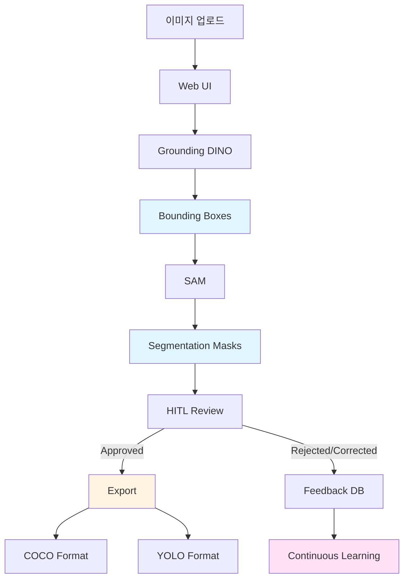

# DINO-SAM Auto Labeling Agent

Grounding DINO + SAM 기반 자동 라벨링 파이프라인 with Human-In-The-Loop (HITL)

## 개요

이 프로젝트는 이미지에 대한 자동 라벨링을 수행하는 파이프라인입니다:
- **Grounding DINO**: 텍스트 프롬프트 기반 오브젝트 검출 (Bounding Box)
- **SAM (Segment Anything Model)**: 정밀한 세그멘테이션 마스크 생성
- **Web UI**: 이미지 업로드 및 라벨링 결과 확인
- **HITL (Human-In-The-Loop)**: 품질 검증 (Pass/Fail) 및 피드백
- **Export**: COCO, YOLO 포맷 지원
- **Continuous Learning**: 피드백 기반 모델 업데이트 지원

## 아키텍처



## 설치

### 1. 필수 요구사항

- Python 3.10 이상
- CUDA 지원 GPU (권장, CPU도 가능하지만 느림)

### 2. 의존성 설치

```bash
# 기본 패키지 설치
pip install -r requirements.txt

# Grounding DINO 설치
pip install groundingdino-py

# 또는 소스에서 설치:
git clone https://github.com/IDEA-Research/GroundingDINO.git
cd GroundingDINO
pip install -e .

# SAM 설치
pip install git+https://github.com/facebookresearch/segment-anything.git
```

### 3. 모델 체크포인트 다운로드

#### Grounding DINO 체크포인트

```bash
mkdir -p weights

# SwinB (권장, 고정밀도)
wget https://github.com/IDEA-Research/GroundingDINO/releases/download/v0.1.0-alpha2/groundingdino_swinb_cogcoor.pth -O weights/groundingdino_swinb_cogcoor.pth

# 또는 SwinT (경량)
wget https://github.com/IDEA-Research/GroundingDINO/releases/download/v0.1.0-alpha/groundingdino_swint_ogc.pth -O weights/groundingdino_swint_ogc.pth
```

#### SAM 체크포인트 (선택사항 - 자동 다운로드 지원)

```bash
# SAM ViT-H (기본, 가장 정확)
wget https://dl.fbaipublicfiles.com/segment_anything/sam_vit_h_4b8939.pth -O ~/.cache/sam/sam_vit_h.pth

# SAM ViT-L (중간 크기)
wget https://dl.fbaipublicfiles.com/segment_anything/sam_vit_l_0b3195.pth -O ~/.cache/sam/sam_vit_l.pth

# SAM ViT-B (가장 작음, 빠름)
wget https://dl.fbaipublicfiles.com/segment_anything/sam_vit_b_01ec64.pth -O ~/.cache/sam/sam_vit_b.pth
```

## 환경변수 설정

### .env 파일 사용 (권장)

프로젝트 루트에 `.env` 파일을 생성하고 다음 내용을 추가하세요:

```bash
# .env 파일 예시
CONFIDENCE_THRESHOLD=0.35
OUTPUT_FORMAT=coco
DEVICE=cuda
SAM_CHECKPOINT_PATH=/path/to/checkpoint.pth
```

`.env.example` 파일을 참고하여 복사하세요:
```bash
cp .env.example .env
```

## 실행 방법

### 1. Web UI 실행 (권장)

```bash
# FastAPI 서버 시작
python -m agent.app

# 또는 uvicorn 직접 실행
uvicorn agent.app:app --host 0.0.0.0 --port 8000 --reload
```

브라우저에서 `http://localhost:8000` 접속

#### Web UI 기능

- **이미지 업로드**: 드래그 앤 드롭 또는 파일 선택
- **프롬프트 입력**: 검출할 객체 (예: "phone, screen, crack")
- **라벨링 실행**: 자동 객체 검출 및 세그멘테이션
- **결과 확인**: Bounding Box 및 마스크 시각화
- **HITL 피드백**: Pass/Fail 품질 검증
- **라벨 내보내기**: COCO/YOLO 포맷

### 2. CLI 실행

```bash
# 기본 실행
python -m agent.run \
  --input /path/to/images \
  --prompt "phone, screen, crack" \
  --threshold 0.35

# 고급 옵션
python -m agent.run \
  --input /path/to/images \
  --prompt "phone, screen, crack" \
  --threshold 0.35 \
  --output-format coco \
  --output-dir ./output \
  --device cuda \
  --verbose
```

### CLI 옵션

| 옵션 | 필수 | 설명 | 기본값 |
|------|------|------|--------|
| `--input` | ✅ | 이미지 디렉터리 경로 | - |
| `--prompt` | ✅ | 텍스트 프롬프트 (쉼표로 구분) | - |
| `--threshold` | ❌ | Confidence threshold | 0.35 |
| `--output-format` | ❌ | 출력 포맷 (`coco` or `yolo`) | `coco` |
| `--output-dir` | ❌ | 출력 디렉터리 | `./output` |
| `--device` | ❌ | 디바이스 (`cuda` or `cpu`) | 자동 선택 |
| `--verbose` | ❌ | 상세 로그 출력 | False |

## API 엔드포인트

### 이미지 업로드
```bash
POST /upload
Content-Type: multipart/form-data

# Response
{
  "image_id": "uuid-string",
  "filename": "image.jpg",
  "path": "/uploads/uuid-string.jpg"
}
```

### 라벨링 실행
```bash
POST /label
Content-Type: application/json

{
  "image_id": "uuid-string",
  "prompt": "phone, screen, crack",
  "confidence_threshold": 0.35
}

# Response
{
  "image_id": "uuid-string",
  "num_objects": 3,
  "boxes": [[x1, y1, x2, y2], ...],
  "labels": ["phone", "screen", "crack"],
  "scores": [0.95, 0.87, 0.72]
}
```

### HITL 피드백 제출
```bash
POST /feedback
Content-Type: application/json

{
  "image_id": "uuid-string",
  "status": "approved",  // approved, rejected, corrected
  "corrections": {...},  // 수정된 라벨 (optional)
  "notes": "추가 메모"   // optional
}
```

### 라벨 내보내기
```bash
POST /export
Content-Type: application/json

{
  "image_ids": ["uuid-1", "uuid-2"],
  "format": "coco"  // coco or yolo
}
```

### 통계 조회
```bash
GET /stats

# Response
{
  "total": 100,
  "pending": 20,
  "approved": 70,
  "rejected": 5,
  "corrected": 5
}
```

## 프로젝트 구조

```
labeling-agent/
├── agent/
│   ├── __init__.py
│   ├── app.py                 # FastAPI 웹 서버
│   ├── config.py              # 설정 관리
│   ├── pipeline.py            # DINO-SAM 파이프라인
│   ├── feedback.py            # HITL 피드백 관리
│   ├── run.py                 # CLI 진입점
│   ├── models/
│   │   ├── __init__.py
│   │   ├── dino.py            # Grounding DINO 래퍼
│   │   └── sam.py             # SAM 래퍼
│   ├── converters/
│   │   ├── __init__.py
│   │   ├── coco_format.py     # COCO 포맷 변환기
│   │   └── yolo_format.py     # YOLO 포맷 변환기
│   ├── training/
│   │   ├── __init__.py
│   │   ├── data_collector.py  # 학습 데이터 수집
│   │   └── trainer.py         # Continuous Learning
│   ├── static/                # 정적 파일 (CSS, JS)
│   └── templates/             # HTML 템플릿
├── weights/                   # 모델 체크포인트
├── uploads/                   # 업로드된 이미지
├── output/                    # 라벨 출력
├── requirements.txt
├── pyproject.toml
└── README.md
```

## 모델 사용법

### Grounding DINO

```python
from agent.models.dino import GroundingDINO

# 모델 초기화
dino = GroundingDINO(
    model_name="groundingdino/groundingdino_swinb_cogcoor",
    device="cuda"
)

# 예측 (이미지 경로로 입력)
boxes, scores, labels = dino.predict(
    image_path="/path/to/image.jpg",
    text_prompt="phone. screen. crack",
    box_threshold=0.35,
    text_threshold=0.25
)

# boxes: (N, 4) [x1, y1, x2, y2] 정규화 좌표 (0-1)
# scores: (N,) confidence scores
# labels: List[str] 검출된 클래스
```

### SAM

```python
from agent.models.sam import SAM
from PIL import Image

# 모델 초기화
sam = SAM(model_name="sam_vit_h", device="cuda")

# 이미지 로드
image = Image.open("/path/to/image.jpg")

# Bounding Box로 마스크 생성
masks = sam.predict(
    image=image,
    boxes=boxes,           # (N, 4) [x1, y1, x2, y2] 픽셀 좌표
    multimask_output=False
)

# masks: List[np.ndarray] 각 박스에 대한 binary 마스크
```

### 파이프라인 (DINO + SAM)

```python
from agent.config import Config
from agent.pipeline import LabelingPipeline

# 설정 및 파이프라인 초기화
config = Config()
pipeline = LabelingPipeline(config)

# 단일 이미지 처리
result = pipeline.process_image(
    image="/path/to/image.jpg",
    text_prompt="phone, screen, crack",
    confidence_threshold=0.35
)

# 결과 확인
print(f"검출된 객체 수: {result.num_objects}")
print(f"박스: {result.boxes}")
print(f"라벨: {result.labels}")
print(f"마스크 있음: {result.has_masks}")

# COCO 포맷으로 내보내기
pipeline.export_coco(result, "/path/to/output.json")

# YOLO 포맷으로 내보내기
pipeline.export_yolo(result, "/path/to/output.txt")
```

## 출력 포맷

### COCO Format

```json
{
  "images": [
    {"id": 1, "file_name": "image.jpg", "width": 1920, "height": 1080}
  ],
  "annotations": [
    {
      "id": 1,
      "image_id": 1,
      "category_id": 1,
      "bbox": [100, 200, 300, 400],
      "segmentation": [[x1, y1, x2, y2, ...]],
      "area": 120000,
      "iscrowd": 0
    }
  ],
  "categories": [
    {"id": 1, "name": "phone"}
  ]
}
```

### YOLO Format

```
# labels/image.txt
# class_id center_x center_y width height
0 0.5 0.5 0.3 0.4
1 0.3 0.7 0.2 0.3
```

## 트러블슈팅

### 1. 모델 로드 오류

**증상**: `ImportError` 또는 모델 로드 실패

**해결**:
```bash
# Grounding DINO 설치 확인
pip install groundingdino-py

# SAM 설치 확인
pip install git+https://github.com/facebookresearch/segment-anything.git

# 체크포인트 확인
ls weights/groundingdino_swinb_cogcoor.pth
```

### 2. GPU 메모리 부족

**증상**: CUDA out of memory 오류

**해결**:
- 작은 SAM 모델 사용: `sam_vit_b` 또는 `sam_vit_l`
- CPU 사용: `--device cpu`
- 이미지 크기 축소

### 3. 검출 결과 없음

**증상**: 이미지 처리 후 검출된 박스가 없음

**해결**:
- `--threshold` 값을 낮춤 (예: 0.25)
- 프롬프트 형식 확인: `"phone. screen. crack"` (마침표 구분)
- 이미지 품질 확인

### 4. 마스크 생성 실패

**증상**: SAM 마스크가 비어있거나 잘못됨

**해결**:
- OpenCV 설치 확인: `pip install opencv-python`
- Bounding Box 좌표 확인 (픽셀 좌표인지)
- 이미지 크기와 박스 좌표 일치 확인

## 성능 최적화

### GPU 사용

```bash
# CUDA 확인
nvidia-smi

# GPU 사용
python -m agent.app  # 자동으로 CUDA 사용
```

### 모델 선택

| 모델 | 정확도 | 속도 | 메모리 |
|------|--------|------|--------|
| SAM ViT-H | ⭐⭐⭐ | ⭐ | ⭐ |
| SAM ViT-L | ⭐⭐ | ⭐⭐ | ⭐⭐ |
| SAM ViT-B | ⭐ | ⭐⭐⭐ | ⭐⭐⭐ |

## 라이선스

MIT License

## 참고 자료

- [Grounding DINO](https://github.com/IDEA-Research/GroundingDINO)
- [Segment Anything Model (SAM)](https://github.com/facebookresearch/segment-anything)
