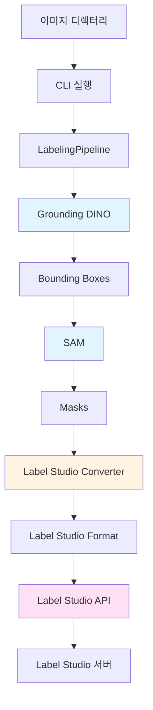

# Labeling Pipeline Agent

Label Studio + Grounding DINO + SAM 기반 자동 프리라벨링 파이프라인

## 개요

이 프로젝트는 이미지에 대한 자동 프리라벨링(pre-labeling)을 수행하는 파이프라인입니다. Grounding DINO로 오브젝트를 검출하고, SAM으로 세그멘테이션 마스크를 생성한 후, Label Studio에 업로드합니다.

## 아키텍처



## 설치

### 1. 필수 요구사항

- Python 3.10 이상
- CUDA 지원 GPU (선택사항, CPU도 가능하지만 느림)
- Label Studio 서버 실행 중

### 2. 의존성 설치

```bash
# 기본 패키지 설치
pip install -r requirements.txt

# Grounding DINO 설치
pip install groundingdino-py

# 또는 소스에서 설치:
git clone https://github.com/IDEA-Research/GroundingDINO.git
cd GroundingDINO
pip install -e .

# SAM 설치
pip install git+https://github.com/facebookresearch/segment-anything.git
```

### 3. SAM 체크포인트 다운로드 (선택사항)

SAM 모델은 자동으로 체크포인트를 다운로드하지만, 수동으로 다운로드할 수도 있습니다:

```bash
# SAM ViT-H (기본, 가장 정확)
wget https://dl.fbaipublicfiles.com/segment_anything/sam_vit_h_4b8939.pth -O ~/.cache/sam/sam_vit_h.pth

# SAM ViT-L (중간 크기)
wget https://dl.fbaipublicfiles.com/segment_anything/sam_vit_l_0b3195.pth -O ~/.cache/sam/sam_vit_l.pth

# SAM ViT-B (가장 작음, 빠름)
wget https://dl.fbaipublicfiles.com/segment_anything/sam_vit_b_01ec64.pth -O ~/.cache/sam/sam_vit_b.pth
```

환경변수로 체크포인트 경로 지정:
```bash
export SAM_CHECKPOINT_PATH=~/.cache/sam/sam_vit_h.pth
```

## 환경변수 설정

### 방법 1: .env 파일 사용 (권장)

프로젝트 루트에 `.env` 파일을 생성하고 다음 내용을 추가하세요:

```bash
# .env 파일 예시
LS_URL=http://localhost:8080
LS_API_TOKEN=your_api_token_here
LS_PROJECT_ID=1

# 선택사항
CONFIDENCE_THRESHOLD=0.35
BATCH_SIZE=1
OUTPUT_FORMAT=polygonlabels
DEVICE=cuda
SAM_CHECKPOINT_PATH=/path/to/checkpoint.pth
```

`.env.example` 파일을 참고하여 복사하세요:
```bash
# .env.example 파일이 있다면
cp .env.example .env

# 또는 직접 생성
cat > .env << EOF
LS_URL=http://localhost:8080
LS_API_TOKEN=your_api_token_here
LS_PROJECT_ID=1
EOF

# .env 파일을 열어서 실제 값으로 수정
```

**주의**: `.env` 파일은 Git에 커밋하지 마세요 (`.gitignore`에 포함됨)

### 방법 2: 시스템 환경변수 사용

```bash
# 필수
export LS_URL=http://localhost:8080              # Label Studio 서버 URL
export LS_API_TOKEN=your_api_token_here          # Label Studio API 토큰
export LS_PROJECT_ID=1                           # Label Studio 프로젝트 ID

# 선택사항
export CONFIDENCE_THRESHOLD=0.35                 # DINO confidence threshold (기본: 0.35)
export BATCH_SIZE=1                              # 배치 크기 (기본: 1)
export OUTPUT_FORMAT=polygonlabels               # 출력 포맷: polygonlabels or rectanglelabels (기본: polygonlabels)
export DEVICE=cuda                               # 디바이스: cuda or cpu (기본: 자동 선택)
export SAM_CHECKPOINT_PATH=/path/to/checkpoint.pth  # SAM 체크포인트 경로
```

**우선순위**: 시스템 환경변수 > .env 파일

### Label Studio API 토큰 얻기

1. Label Studio에 로그인
2. Settings → Account & Security → Access Token
3. 토큰 생성 또는 기존 토큰 복사

## Label Studio 라벨 설정

Label Studio 프로젝트를 생성할 때 다음 설정을 사용하세요:

### polygonlabels 포맷 (기본, 권장)

```xml
<View>
  <Image name="image" value="$image"/>
  <PolygonLabels name="label" toName="image">
    <Label value="phone" background="red"/>
    <Label value="screen" background="blue"/>
    <Label value="crack" background="orange"/>
    <Label value="scratch" background="green"/>
  </PolygonLabels>
</View>
```

### rectanglelabels 포맷

```xml
<View>
  <Image name="image" value="$image"/>
  <RectangleLabels name="label" toName="image">
    <Label value="phone" background="red"/>
    <Label value="screen" background="blue"/>
    <Label value="crack" background="orange"/>
    <Label value="scratch" background="green"/>
  </RectangleLabels>
</View>
```

**중요**: 
- `name="label"`은 코드의 `from_name`과 일치해야 합니다
- `toName="image"`는 코드의 `to_name`과 일치해야 합니다
- 클래스 이름은 프롬프트와 일치해야 합니다 (대소문자 구분)

## 실행

### 기본 실행

```bash
python -m agent.run \
  --input /path/to/images \
  --prompt "phone, screen, crack, scratch" \
  --project-id 1 \
  --threshold 0.35
```

### 고급 옵션

```bash
python -m agent.run \
  --input /path/to/images \
  --prompt "phone, screen" \
  --project-id 1 \
  --threshold 0.35 \
  --batch-size 4 \
  --output-format polygonlabels \
  --device cuda \
  --verbose
```

### CLI 옵션

| 옵션 | 필수 | 설명 | 기본값 |
|------|------|------|--------|
| `--input` | ✅ | 이미지 디렉터리 경로 | - |
| `--prompt` | ✅ | 텍스트 프롬프트 (쉼표로 구분) | - |
| `--project-id` | ❌ | Label Studio 프로젝트 ID | 환경변수 `LS_PROJECT_ID` |
| `--threshold` | ❌ | Confidence threshold | 0.35 |
| `--batch-size` | ❌ | 배치 크기 | 1 |
| `--output-format` | ❌ | 출력 포맷 (`polygonlabels` or `rectanglelabels`) | `polygonlabels` |
| `--device` | ❌ | 디바이스 (`cuda` or `cpu`) | 자동 선택 |
| `--verbose` | ❌ | 상세 로그 출력 | False |

## 프로젝트 구조

```
pipeline/
├── agent/
│   ├── __init__.py
│   ├── config.py              # 설정 관리
│   ├── ls_client.py            # Label Studio API 클라이언트
│   ├── pipeline.py             # 파이프라인 오케스트레이션
│   ├── run.py                  # CLI 진입점
│   ├── models/
│   │   ├── __init__.py
│   │   ├── dino.py             # Grounding DINO 래퍼
│   │   └── sam.py              # SAM 래퍼
│   └── converters/
│       ├── __init__.py
│       └── ls_format.py        # Label Studio 포맷 변환기
├── requirements.txt
├── pyproject.toml
└── README.md
```

## 실행 체크리스트

### 사전 준비

- [ ] Python 3.10+ 설치 확인
- [ ] Label Studio 서버 실행 중 확인
- [ ] Label Studio 프로젝트 생성 및 ID 확인
- [ ] Label Studio API 토큰 생성
- [ ] `.env` 파일 생성 및 설정 (또는 환경변수 설정)
  - `.env.example`을 복사하여 `.env` 생성
  - `LS_URL`, `LS_API_TOKEN`, `LS_PROJECT_ID` 설정
- [ ] 의존성 설치 완료 (requirements.txt)
- [ ] Grounding DINO 설치 완료
- [ ] SAM 설치 완료
- [ ] SAM 체크포인트 다운로드 (자동 또는 수동)
- [ ] Label Studio 라벨 설정 확인 (코드와 일치)

### 실행 전 확인

- [ ] 이미지 디렉터리 경로 확인
- [ ] 이미지 파일 형식 확인 (jpg, png, bmp, tiff 등)
- [ ] 프롬프트 클래스 이름이 Label Studio 설정과 일치하는지 확인
- [ ] GPU 사용 시 CUDA 설치 확인 (`nvidia-smi`)

### 실행

```bash
# 테스트 실행 (작은 이미지 세트)
python -m agent.run \
  --input ./test_images \
  --prompt "phone, screen" \
  --project-id 1 \
  --threshold 0.35 \
  --verbose

# 프로덕션 실행
python -m agent.run \
  --input /data/images \
  --prompt "phone, screen, crack, scratch" \
  --project-id 1 \
  --threshold 0.35 \
  --batch-size 4 \
  --output-format polygonlabels
```

### 실행 후 확인

- [ ] Label Studio에서 태스크가 생성되었는지 확인
- [ ] 예측(pre-label)이 업로드되었는지 확인
- [ ] 라벨이 올바르게 표시되는지 확인
- [ ] 좌표가 정확한지 확인 (이미지 크기와 일치)
- [ ] 클래스 이름이 올바른지 확인

## 트러블슈팅

### 1. Label Studio 포맷 오류

**증상**: Label Studio에서 라벨이 표시되지 않음

**원인 및 해결**:
- **라벨 설정 불일치**: Label Studio 설정의 `name`과 `toName`이 코드와 일치하는지 확인
  - 코드: `from_name="label"`, `to_name="image"`
  - Label Studio: `name="label"`, `toName="image"`
- **클래스 이름 불일치**: 프롬프트의 클래스 이름이 Label Studio 설정과 정확히 일치해야 함
  - 예: 프롬프트 `"phone, screen"` → Label Studio에 `phone`, `screen` 레이블 필요
- **출력 포맷 불일치**: `--output-format`과 Label Studio 설정이 일치해야 함
  - `polygonlabels` → `<PolygonLabels>`
  - `rectanglelabels` → `<RectangleLabels>`

### 2. 좌표계 문제

**증상**: 라벨이 이미지 밖에 표시되거나 크기가 이상함

**원인 및 해결**:
- **좌표 형식**: Label Studio는 퍼센트 좌표(0-100)를 사용
- **이미지 크기**: 이미지 로드 시 실제 크기를 사용해야 함
- **정규화 좌표**: DINO는 정규화 좌표(0-1)를 반환하므로 픽셀 좌표로 변환 필요

**확인 방법**:
```python
# 디버깅: 이미지 크기 확인
from PIL import Image
img = Image.open("test.jpg")
print(f"이미지 크기: {img.size}")  # (width, height)
```

### 3. 마스크 변환 오류

**증상**: `polygonlabels` 포맷에서 마스크가 제대로 변환되지 않음

**원인 및 해결**:
- **컨투어 찾기 실패**: OpenCV가 제대로 설치되었는지 확인
  ```bash
  pip install opencv-python
  ```
- **최소 영역 필터**: 너무 작은 마스크는 제외됨 (기본: 100 픽셀)
  - `converters/ls_format.py`의 `min_area` 파라미터 조정
- **마스크 형식**: 마스크는 binary (0 또는 1)여야 함
- **이미지 채널**: Grayscale 이미지는 RGB로 변환됨

**해결책**:
```python
# polygonlabels 대신 rectanglelabels 사용
python -m agent.run --output-format rectanglelabels ...
```

### 4. 모델 로드 오류

**증상**: `ImportError` 또는 모델 로드 실패

**원인 및 해결**:
- **Grounding DINO 미설치**:
  ```bash
  pip install groundingdino-py
  ```
- **SAM 미설치**:
  ```bash
  pip install git+https://github.com/facebookresearch/segment-anything.git
  ```
- **체크포인트 경로 오류**: SAM 체크포인트가 올바른 경로에 있는지 확인
  ```bash
  ls ~/.cache/sam/sam_vit_h.pth
  ```

### 5. GPU 메모리 부족

**증상**: CUDA out of memory 오류

**해결책**:
- **작은 모델 사용**: `sam_vit_b` 또는 `sam_vit_l` 사용
  ```bash
  export SAM_MODEL_NAME=sam_vit_b
  ```
- **배치 크기 감소**: `--batch-size 1`
- **CPU 사용**: `--device cpu` (느리지만 메모리 문제 없음)

### 6. Label Studio 연결 오류

**증상**: API 요청 실패 (Connection refused, 401 Unauthorized 등)

**원인 및 해결**:
- **서버 미실행**: Label Studio 서버가 실행 중인지 확인
  ```bash
  label-studio start
  ```
- **URL 오류**: `LS_URL`이 올바른지 확인 (끝에 `/` 제거)
  ```bash
  export LS_URL=http://localhost:8080  # ✅ 올바름
  export LS_URL=http://localhost:8080/  # ❌ 잘못됨
  ```
- **토큰 오류**: API 토큰이 올바른지 확인
  - Label Studio → Settings → Access Token
- **프로젝트 ID 오류**: 프로젝트 ID가 존재하는지 확인
  ```bash
  # 프로젝트 목록 확인 (API 또는 웹 UI)
  curl -H "Authorization: Token $LS_API_TOKEN" $LS_URL/api/projects
  ```

### 7. 검출 결과 없음

**증상**: 이미지를 처리했지만 검출된 박스가 없음

**원인 및 해결**:
- **Threshold 너무 높음**: `--threshold` 값을 낮춤 (예: 0.25)
- **프롬프트 불일치**: 이미지에 실제로 존재하는 객체를 프롬프트에 포함
- **이미지 품질**: 이미지가 너무 작거나 흐릿하면 검출 어려움

**디버깅**:
```bash
# 상세 로그로 실행
python -m agent.run --verbose ...
```

### 8. 로컬 파일 경로 문제

**증상**: Label Studio에서 이미지를 불러올 수 없음

**원인**: Label Studio는 로컬 파일 경로를 직접 접근할 수 없음

**해결책**:
1. **파일 서버 사용**: 이미지를 HTTP URL로 제공
   ```python
   # 예: http://localhost:8000/images/image1.jpg
   ```
2. **Label Studio 파일 업로드**: Label Studio에 직접 이미지 업로드
3. **공유 스토리지**: Label Studio 서버가 접근 가능한 공유 디렉터리 사용

**임시 해결책** (개발/테스트용):
- Label Studio를 로컬에서 실행하고 이미지 디렉터리를 마운트
- 또는 이미지를 Label Studio에 직접 업로드 후 태스크 생성

## 성능 최적화

### GPU 사용

```bash
# CUDA 확인
nvidia-smi

# GPU 사용 (자동 선택)
python -m agent.run --device cuda ...
```

### 배치 처리

```bash
# 배치 크기 증가 (GPU 메모리에 따라 조정)
python -m agent.run --batch-size 4 ...
```

### 모델 선택

- **SAM ViT-H**: 가장 정확하지만 느리고 메모리 많이 사용
- **SAM ViT-L**: 균형잡힌 선택
- **SAM ViT-B**: 빠르고 메모리 적게 사용하지만 정확도 낮음

```bash
# 환경변수로 모델 선택
export SAM_MODEL_NAME=sam_vit_b
```

## 예제

### 예제 1: 스마트폰 결함 검출

```bash
export LS_URL=http://localhost:8080
export LS_API_TOKEN=your_token
export LS_PROJECT_ID=1

python -m agent.run \
  --input ./phone_images \
  --prompt "phone, screen, crack, scratch, dent" \
  --threshold 0.35 \
  --output-format polygonlabels
```

### 예제 2: 빠른 처리 (rectanglelabels)

```bash
python -m agent.run \
  --input ./images \
  --prompt "object" \
  --threshold 0.3 \
  --output-format rectanglelabels \
  --batch-size 8
```

## 라이선스

MIT License

## 참고 자료

- [Label Studio Documentation](https://labelstud.io/guide/)
- [Grounding DINO](https://github.com/IDEA-Research/GroundingDINO)
- [Segment Anything Model (SAM)](https://github.com/facebookresearch/segment-anything)

